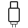

# Frokost — A Huddly Icon Library ✨

## How to install

Run the following command to install the library:

```bash
npm install Huddly/frokost --save
```

## Icon packages and imports


### Granola
| Icon | Name | ESM import |
| --- | --- | --- |
|  | Analytics | `import { Analytics } from '@huddly/frokost/granola'` |
|  | Business Card | `import { BusinessCard } from '@huddly/frokost/granola'` |
|  | Clipboard | `import { Clipboard } from '@huddly/frokost/granola'` |
|  | Contact | `import { Contact } from '@huddly/frokost/granola'` |
|  | Document | `import { Document } from '@huddly/frokost/granola'` |
|  | Easy | `import { Easy } from '@huddly/frokost/granola'` |
|  | Ethernet | `import { Ethernet } from '@huddly/frokost/granola'` |
|  | Framing | `import { Framing } from '@huddly/frokost/granola'` |
|  | Gallery View | `import { GalleryView } from '@huddly/frokost/granola'` |
|  | Genious Framing | `import { GeniousFraming } from '@huddly/frokost/granola'` |
|  | Group | `import { Group } from '@huddly/frokost/granola'` |
|  | IQ or One | `import { IqOrOne } from '@huddly/frokost/granola'` |
|  | Image Processing | `import { ImageProcessing } from '@huddly/frokost/granola'` |
|  | Image Quality | `import { ImageQuality } from '@huddly/frokost/granola'` |
|  | L1 or S1 | `import { L1OrS1 } from '@huddly/frokost/granola'` |
|  | Microphone | `import { Microphone } from '@huddly/frokost/granola'` |
|  | Open APIs | `import { OpenApIs } from '@huddly/frokost/granola'` |
|  | Person | `import { Person } from '@huddly/frokost/granola'` |
|  | Portrait Lighting | `import { PortraitLighting } from '@huddly/frokost/granola'` |
|  | Product Support | `import { ProductSupport } from '@huddly/frokost/granola'` |
|  | Recording Quality | `import { RecordingQuality } from '@huddly/frokost/granola'` |
|  | Speaker Framing | `import { SpeakerFraming } from '@huddly/frokost/granola'` |
|  | USB | `import { Usb } from '@huddly/frokost/granola'` |
|  | Upgrade | `import { Upgrade } from '@huddly/frokost/granola'` |
|  | Whiteboard Enhancement | `import { WhiteboardEnhancement } from '@huddly/frokost/granola'` |
|  | Wide-angle | `import { WideAngle } from '@huddly/frokost/granola'` |

### Havre
| Icon | Name | ESM import |
| --- | --- | --- |
|  | Add user | `import { AddUser } from '@huddly/frokost/havre'` |
|  | Add | `import { Add } from '@huddly/frokost/havre'` |
|  | Arrow down | `import { ArrowDown } from '@huddly/frokost/havre'` |
|  | Arrow left | `import { ArrowLeft } from '@huddly/frokost/havre'` |
|  | Arrow right | `import { ArrowRight } from '@huddly/frokost/havre'` |
|  | Arrow up | `import { ArrowUp } from '@huddly/frokost/havre'` |
|  | Calendar | `import { Calendar } from '@huddly/frokost/havre'` |
|  | Check | `import { Check } from '@huddly/frokost/havre'` |
|  | Chevron down | `import { ChevronDown } from '@huddly/frokost/havre'` |
|  | Chevron left | `import { ChevronLeft } from '@huddly/frokost/havre'` |
|  | Chevron right | `import { ChevronRight } from '@huddly/frokost/havre'` |
|  | Chevron up | `import { ChevronUp } from '@huddly/frokost/havre'` |
|  | Clock | `import { Clock } from '@huddly/frokost/havre'` |
|  | Contact | `import { Contact } from '@huddly/frokost/havre'` |
|  | Cross | `import { Cross } from '@huddly/frokost/havre'` |
|  | Delete | `import { Delete } from '@huddly/frokost/havre'` |
|  | Desktop Framing | `import { DesktopFraming } from '@huddly/frokost/havre'` |
|  | Disconnected | `import { Disconnected } from '@huddly/frokost/havre'` |
|  | Download | `import { Download } from '@huddly/frokost/havre'` |
|  | Edit | `import { Edit } from '@huddly/frokost/havre'` |
|  | Envelope | `import { Envelope } from '@huddly/frokost/havre'` |
|  | Ethernet | `import { Ethernet } from '@huddly/frokost/havre'` |
|  | External Link | `import { ExternalLink } from '@huddly/frokost/havre'` |
|  | Filter | `import { Filter } from '@huddly/frokost/havre'` |
|  | Folder | `import { Folder } from '@huddly/frokost/havre'` |
|  | Framing | `import { Framing } from '@huddly/frokost/havre'` |
|  | Gallery View | `import { GalleryView } from '@huddly/frokost/havre'` |
|  | Help | `import { Help } from '@huddly/frokost/havre'` |
|  | Hide Password | `import { HidePassword } from '@huddly/frokost/havre'` |
|  | Image Quality | `import { ImageQuality } from '@huddly/frokost/havre'` |
|  | Info | `import { Info } from '@huddly/frokost/havre'` |
|  | Menu Hamburger | `import { MenuHamburger } from '@huddly/frokost/havre'` |
|  | Menu Kebab | `import { MenuKebab } from '@huddly/frokost/havre'` |
|  | Menu Meatball | `import { MenuMeatball } from '@huddly/frokost/havre'` |
|  | Minus | `import { Minus } from '@huddly/frokost/havre'` |
|  | Move | `import { Move } from '@huddly/frokost/havre'` |
|  | Pane Left | `import { PaneLeft } from '@huddly/frokost/havre'` |
|  | Pane Right | `import { PaneRight } from '@huddly/frokost/havre'` |
|  | Plus | `import { Plus } from '@huddly/frokost/havre'` |
|  | Portrait Lighting | `import { PortraitLighting } from '@huddly/frokost/havre'` |
|  | Profile | `import { Profile } from '@huddly/frokost/havre'` |
|  | Refresh | `import { Refresh } from '@huddly/frokost/havre'` |
|  | Remove | `import { Remove } from '@huddly/frokost/havre'` |
|  | Search | `import { Search } from '@huddly/frokost/havre'` |
|  | Settings | `import { Settings } from '@huddly/frokost/havre'` |
|  | Show Password | `import { ShowPassword } from '@huddly/frokost/havre'` |
|  | Speaker Framing | `import { SpeakerFraming } from '@huddly/frokost/havre'` |
|  | Subtract | `import { Subtract } from '@huddly/frokost/havre'` |
|  | Success Filled | `import { SuccessFilled } from '@huddly/frokost/havre'` |
|  | Success | `import { Success } from '@huddly/frokost/havre'` |
|  | USB | `import { Usb } from '@huddly/frokost/havre'` |
|  | Update | `import { Update } from '@huddly/frokost/havre'` |
|  | User | `import { User } from '@huddly/frokost/havre'` |
|  | Users | `import { Users } from '@huddly/frokost/havre'` |
|  | Video Camera | `import { VideoCamera } from '@huddly/frokost/havre'` |
|  | Warning Filled | `import { WarningFilled } from '@huddly/frokost/havre'` |
|  | Warning | `import { Warning } from '@huddly/frokost/havre'` |
|  | Wide-angle | `import { WideAngle } from '@huddly/frokost/havre'` |
|  | Zoom In | `import { ZoomIn } from '@huddly/frokost/havre'` |
|  | Zoom Out | `import { ZoomOut } from '@huddly/frokost/havre'` |

### Havre18px
| Icon | Name | ESM import |
| --- | --- | --- |
|  | Arrow Down | `import { ArrowDown } from '@huddly/frokost/havre18px'` |
|  | Arrow Up | `import { ArrowUp } from '@huddly/frokost/havre18px'` |
|  | Check | `import { Check } from '@huddly/frokost/havre18px'` |
|  | Chevron Down | `import { ChevronDown } from '@huddly/frokost/havre18px'` |
|  | Chevron Left | `import { ChevronLeft } from '@huddly/frokost/havre18px'` |
|  | Chevron Right | `import { ChevronRight } from '@huddly/frokost/havre18px'` |
|  | Chevron Up | `import { ChevronUp } from '@huddly/frokost/havre18px'` |
|  | Cross | `import { Cross } from '@huddly/frokost/havre18px'` |
|  | Info Small | `import { InfoSmall } from '@huddly/frokost/havre18px'` |
|  | Minus | `import { Minus } from '@huddly/frokost/havre18px'` |
|  | Plus | `import { Plus } from '@huddly/frokost/havre18px'` |
|  | Settings | `import { Settings } from '@huddly/frokost/havre18px'` |
|  | Success Filled | `import { SuccessFilled } from '@huddly/frokost/havre18px'` |
|  | Success | `import { Success } from '@huddly/frokost/havre18px'` |
|  | Warning Filled | `import { WarningFilled } from '@huddly/frokost/havre18px'` |
|  | Warning Small | `import { WarningSmall } from '@huddly/frokost/havre18px'` |
